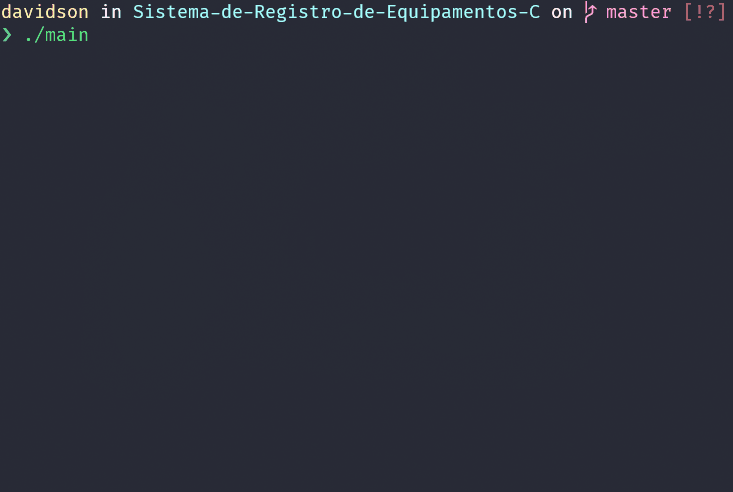
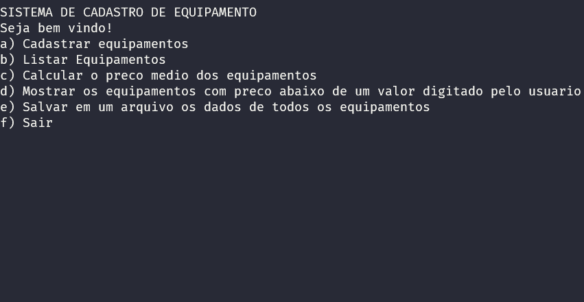
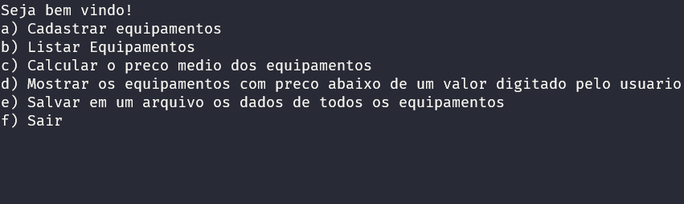
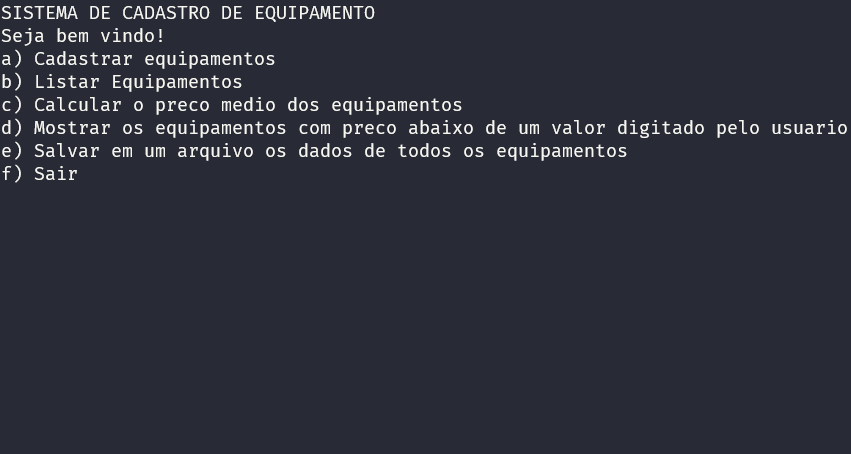

<h1 align="center">Sistemas de Registro de Equipamentos</h1>

<!-- ABOUT -->
<h3>Sobre</h3>

Este programa simula um sistema de registro de equipamentos com diversas funções na linguagem C.
Ele possui um menu que realiza as seguintes funções:

#### 1. Cadastrar equipamento ✔

#### 2. Listar Equipamentos ✔

#### 3. Calcular o preço médio dos equipamentos ✔

#### 4. Mostrar os equipamentos com preço abaixo de um valor digitado pelo usuário ✔

#### 5. Salvar em um arquivo os dados de todos os equipamentos ✔

#### Este programa foi feito na linguagem C.
